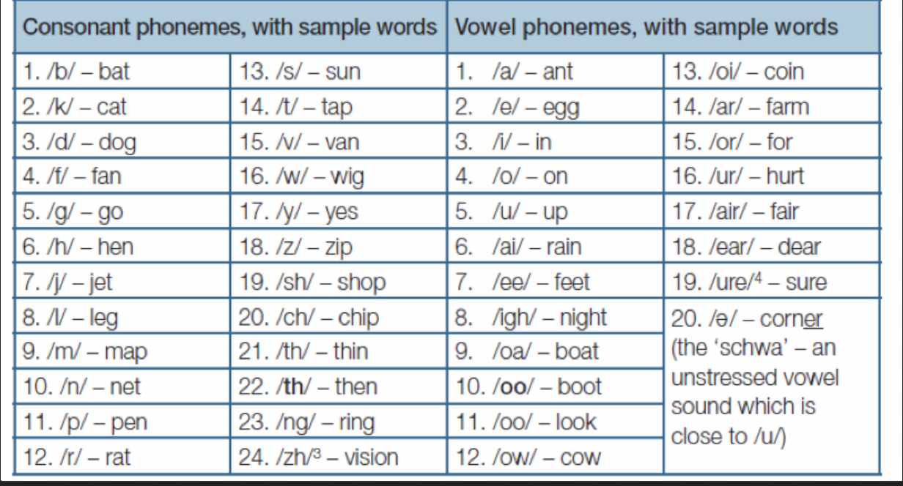

Uppercase
|From | To| Notes|
|---|---|----|
|C | M |this is a wild guess|

Lowercase
|Index| From | To| Notes|
|---|---|----|---|
|4|  d | /e/ |or U|
|5|  e | /i/ ||
|6|  f | /a/ ||
|7|  g | O||
|8|  h |||
|9|  i | /ee/||
|10| j |||
|11| k | /ai/ ||
|12| l |||
|13| m | ||
|14| n | /igh/| |

| original | changes | result | notes |
| ----------- | ----------- | -----| -----|
INSnD   | n->/igh/          | INSIDE |  |
RdSTS   | d->/e/            | RESTS |  |
Ce      | **C->M**, e->/i/  | MY| |
MnND    | n->/igh/          | MIND | |
SPIReT  | e->/i/            | SPIRIT | |
fND     | f->A              | AND | |
dNeRxI  | d->/e/, e->/i/    | ENIRxI | |
gV      | g->O              | OV | |
KERNeL  | e->/i/            | KERNEL | |
MhRKS   |                   | MhRKS | |
LIDeR   | e->/i/            | LIDIR | |
gV      | g->O              | OV | |
CI      | **C->M**          | MI | |
307     |                   | 307 | |
fND     | f->A              | AND | |
GRkTeST | k->/ai/,e->/i/    | GREATEST | |
MnND    | n->/igh/          | MIND | |
gV      | g->O              | OV | |
peR     | e->               | pIR | "our"?|
TnM     | n->/igh/          | TIME | |
Mk      | k->/ai/           | MAY | |
HIZ     |                   | HIZ | |
WIZDeM  |                   | WIZDOM | |
fND     | f->A              | AND | |
dNeRxI  |                   | ENIRxI | |
GnD     | n->/igh/          | GUIDE | |
gS      | g->O              | OS | |
Tb      |                   | | "to" maybe?|
iTERNeTI | i->/ee/, e->I       | ETERNITY | |